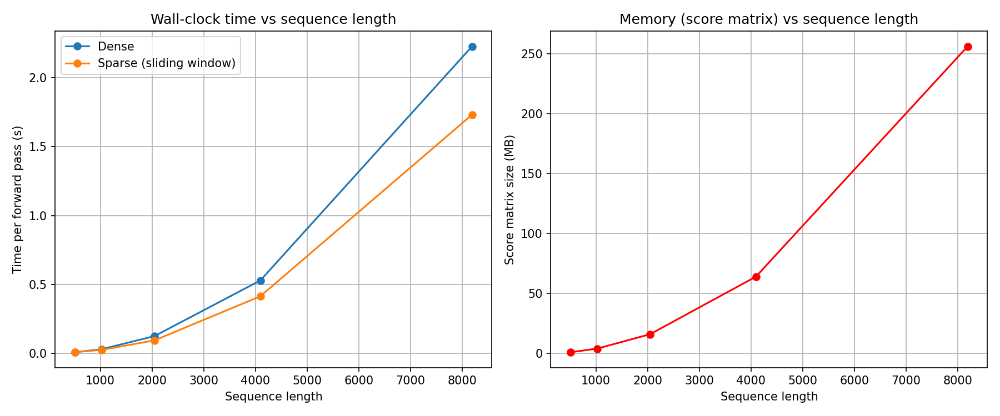
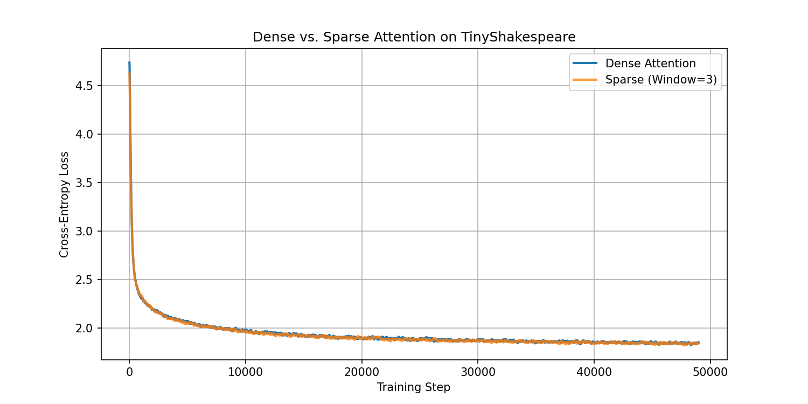

# WRITEUP: Sparse Attention from Scratch

## 1. What I Built

I implemented dense causal attention and a sliding-window sparse attention mechanism from scratch using PyTorch without F.scaled_dot_product_attention. I also integrated a correctness harness, benchmarks with plotting, and a training comparison on TinyShakespeare plotting loss comparison. I also investigated NaN behaviour in masked attention and how to handle it. I tried implementing a BigBird-style: local + global + random sparse attention, but couldn't complete it on time with understanding to all components.

## 2. Correctness

The correctness harness compares dense causal attention against sliding-window attention on positions where both attention patterns have the same allowed context. It also checks if sparse attention doesn't have attention to positions outside the context window.

I also got an issue while making regarding `scaled_scores` which was a leftover global variable while masking, I fixed it by directly taking the masking implementation to take direct scores from `Q` and `K`.

I also encountered comparisons using random seeds where the difference was 0.0, I tested multiple seeds and inspected the values when unrounded, which proved there was no bug in the code and consistent with respect to floating-point precision differences.

## 3. NaN Handling

A masked attention row can become fully '-∞' when every query is masked in some situation. Softmax on this would give NaN values instead of 0 since it can't sum to 1 with zeroes.This happens for real at block boundaries and when causal masking combines with sparsity.

The particular sliding-window mask used in this project always allows allows the current token to attend to itself, so it does not produce an entirely masked row by itself. I have handled it anyway.

While debugging, I accidently handled the NaN values(`nan_to_num`) after output, which I noticed while testing and fixed it, doing it to the attention weights before final matrix multiplication with value tensor.

## 4. Benchmark Results

The benchmark measures the forward-pass wall-clock time as sequence length increases and also shows the size of the score matrix.

The score matrix grows quadratically with sequence length. With float32 scores, its size is approximately:

- 512 tokens: 1 MB
- 1024 tokens: 4 MB
- 2048 tokens: 16 MB
- 4096 tokens: 64 MB
- 8192 tokens: 256 MB

The important limitation is that my current sparse implementation still computes the complete `Q @ K@T` matrix before applying the sparse mask. Thus computing with the whole matrix/tensor despite masking it. The implementation does not avoid the underlying O(n²) score computation. Hence my implementation isn't optimized sparse attention.

A production sparse implementation would need to compute only the query-key pairs allowed by the sparsity pattern.

The benchmark was run on Google Colab CPU. The measured times are therefore mainly useful for comparing the implementations under the same environment rather than as absolute performance numbers. Times varied when I ran them on different days or seeds.

## 5. Training Comparison

Final dense loss: 1.9101
Final sparse loss: 1.8003
(~6 minutes each on Colab CPU, 49,000 steps)

I chose 49k steps based on time calculation and multiplying it to be 10 minutes, but this varied a lot when I reconnected to Colab once being 57k, nevertheless I had already calculated it.

The sparse model was not worse in this experiment. I would not interpret the lower final loss as evidence that sparse attention is inherently better, since this is a small experiment and training has randomness.

One reason the sliding-window model can perform well here is that the task involves predicting characters with a short context. Many useful dependencies are neighbouring so keeping each token inside a window does not necessarily take away a lot of useful information.

There is a tradeoff with sliding window context when the long range context becomes important.

I did not complete the BigBird-style local, global and random attention pattern.

## 6. Conclusion

The main result of this project was learning the distinction between a sparse attention pattern and an actually sparse computation. The sliding-window implementation restricts which tokens can attend to each other, but because it still constructs the full score matrix, it does not yet provide the computational or memory scaling benefits of a true sparse implementation.

The experiments also showed that local attention can work surprisingly well on a small character-level language-modeling task. With more time, I would implement the BigBird-style local + global + random pattern required by the task.

I would also replace the dense masked computation with an actually sparse or block-sparse implementation so that the number of computed attention scores scales with the number of allowed connections rather than the full sequence length. 
